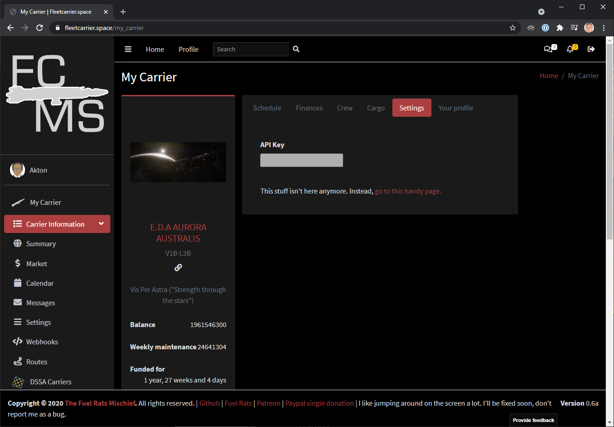

# Introduction

Fleet Carrier Management System (FCMS) is an EDMC plug-in that automatically reports fleet carrier jumps to https://fleetcarrier.space. This website tracks fleet carrier movements and locations, optionally back to a squadron Discord.

**This plug-in is based off the Fuel Rats EDMC plug-in written by Absolver for https://github.com/FuelRats/FCMS. I am not the original author. I merely added an MSI installer and decluttered the main window display.**

# Installation and Upgrade

Requirements:
1. Install [Elite Dangerous Market Connector (EDMC)](https://github.com/EDCD/EDMarketConnector/wiki/Installation-&-Setup) version 6.0 or later. Older versions are not supported.
2. Create an account on https://fleetcarrier.space.
3. Purchase a fleet carrier in **Elite: Dangerous**.

To install:
1. Download the MSI file for the latest release under the [Releases](https://github.com/anthonylangsworth/FCMS/releases) at the top right. You may get a warning saying it is potentially harmful. Please ignore these warnings.
2. Run the MSI. This installs the plug-in, upgrading if an earlier version is present. Running the MSI does not require local administrative privileges.
3. Restart EDMC if it was already running.

# Use

First, create an account on https://fleetcarrier.space. Optionally, configure Discord integration for your squadron's Discord server. You will need your commander name, email address and API key. You can find or create your API key on https://fleetcarrier.space/my_carrier under the "Settings" tab on the right, as shown below:

To configure (only needed once):
1. Run EDMC.
2. Open the "File" -> "Settings" menu. This opens the EDMC settings menu.
3. Navigate to the "FCMS" tab. This shows settings for this plug-in.
4. Enter your commander name, email address and API key from https://fleetcarrier.space. 
5. Click OK to close the dialog and save your settings.

To use:
1. Start EDMC before you jump your fleet carrer, if not when you start playing **Elite: Dangerous**.
2. Operate your fleet carrier as normal.
3. The FCMS plug-in automatically updates https://fleetcarrier.space with your fleet carrier movements.

This plug-in supports multiple accounts, saving different settings for each.

See [LICENSE](LICENSE) for the license. There was no license included with the original source code.

# Limitations

1. The discord integration for https://fleetcarrier.space specifies the source system for a carrier jump. However, this plug-in reports the system the commander was in when issuing the jump order. It does not report the carrier's current system.

# Contributing and Development

Bugs reports and suggestions are welcome! 

See [Contributing](doc/contributing.md) if you want to help with development.
